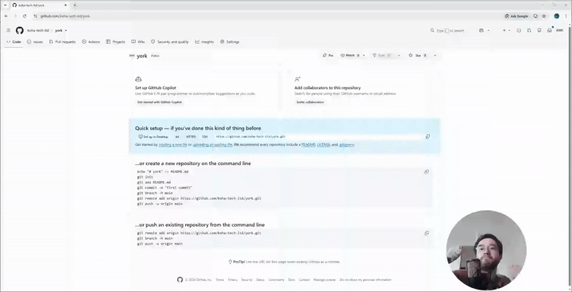

# York

Open-source Loom-like screen recorder for **Windows** and **macOS**.

Floating control bar, rounded camera bubble, screen or window capture with mic, screenshots, and local MP4 / PNG save.

**200% zoom:** hold **Option (⌥)** on Mac or **Alt** on Windows while recording to zoom toward the mouse; release to ease back.

## Download

**[Download for Windows](https://github.com/koha-tech-ltd/york/releases/latest/download/York-Setup-0.1.0.exe)** — York Setup 0.1.0 for Windows 10/11.

The installer is unsigned, so SmartScreen may warn on first run. Click **More info**, then **Run anyway**.

**[Download for macOS](https://github.com/koha-tech-ltd/york/raw/refs/heads/main/releases/York-0.1.0-arm64.dmg?download=)** — York 0.1.0 DMG for Apple silicon (arm64).

The DMG is unsigned. Drag York to Applications, then right-click the app and choose **Open** the first time (Gatekeeper may warn). Intel Macs: [build from source](#build).

## 200% zoom — Option on Mac, Alt on Windows

Hold **Option (⌥)** on macOS or **Alt** on Windows while recording. York smoothly zooms up to **200%** toward the mouse cursor; release to ease back.

<video src="assets/preview.mp4" width="720" controls muted loop playsinline>
  <a href="assets/preview.mp4">Watch the 200% zoom feature (MP4)</a>
</video>



## Features (v1)

- Always-on-top control pill with camera, mic, and screen/window menus
- Rounded, borderless camera bubble (draggable; sizes S / M / L)
- Presentation recording: selected screen or window + camera composited into a rounded corner PiP
- **200% zoom:** hold **Option (⌥)** (macOS) or **Alt** (Windows) to zoom on the mouse; release to ease back
- Microphone with live input meter
- Screenshots of the selected source
- Recordings as H.264 MP4
- Settings (cog): choose folders for videos and screenshots
- While recording, overlays hide so they do not appear as black boxes — **click the York tray icon** to stop
- Control UI uses content protection when visible

## Requirements

- **Windows installer:** Windows 10/11
- **macOS DMG:** macOS 12+ on Apple silicon (arm64)
- **From source:** Node.js 20+, Windows 10/11 or macOS 12+
- On macOS: grant **Camera**, **Microphone**, and **Screen Recording** in System Settings → Privacy & Security

## Develop

```bash
npm install
npm run dev
```

Use the tray icon to show/hide the control bar or quit. During a recording, click the tray icon to stop.

**Tip:** Hold **Option (⌥)** on Mac or **Alt** on Windows to zoom 200% on the cursor while you present.

## Build

```bash
# Current platform
npm run dist

# Explicit targets
npm run dist:win
npm run dist:mac
```

Installers land in `dist/` (Windows: `York Setup x.y.z.exe`, macOS: DMG).

On some Windows machines, electron-builder’s code-sign helper needs Developer Mode (symlink privilege). This project sets `signAndEditExecutable: false` so local unsigned builds still succeed.

### macOS notarization

v1 ships with camera/mic entitlements and usage strings. Notarization is not automated — sign and notarize with your Apple Developer account before distributing outside Gatekeeper.

## License

MIT — see [LICENSE](LICENSE).
